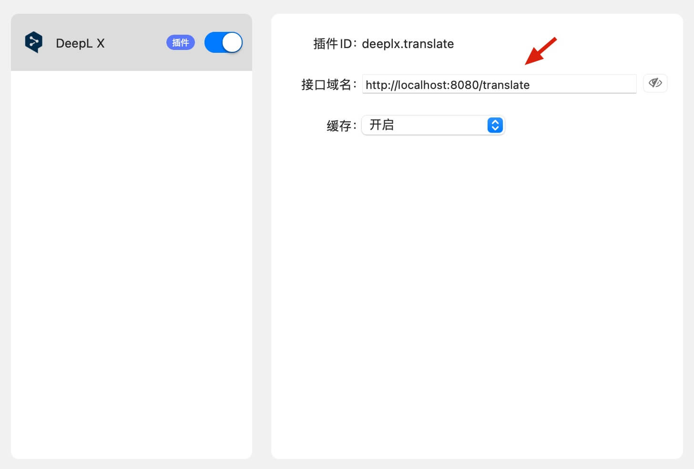

本插件配合 [zu1k/deepl](https://hub.docker.com/r/zu1k/deepl) docker 镜像可使用 DeepL 翻译。

## 安装 Docker

```
brew install --cask docker
```

可以参考 [这个教程](https://yeasy.gitbook.io/docker_practice/install/mac)

## 部署 deepl 镜像

<https://hub.docker.com/r/zu1k/deepl>

```
docker run -itd -p 8080:80 zu1k/deepl
```

## 使用插件

[点此下载插件](https://github.com/clubxdev/bob-plugin-deeplx/raw/main/dist/deeplx.translate.bobplugin)

安装可以参考 [这个教程](https://ripperhe.gitee.io/bob/#/general/quickstart/plugin)

插件设置里面「接口域名」修改为部署 deepl 服务的服务器域名（在本机部署无需修改）


